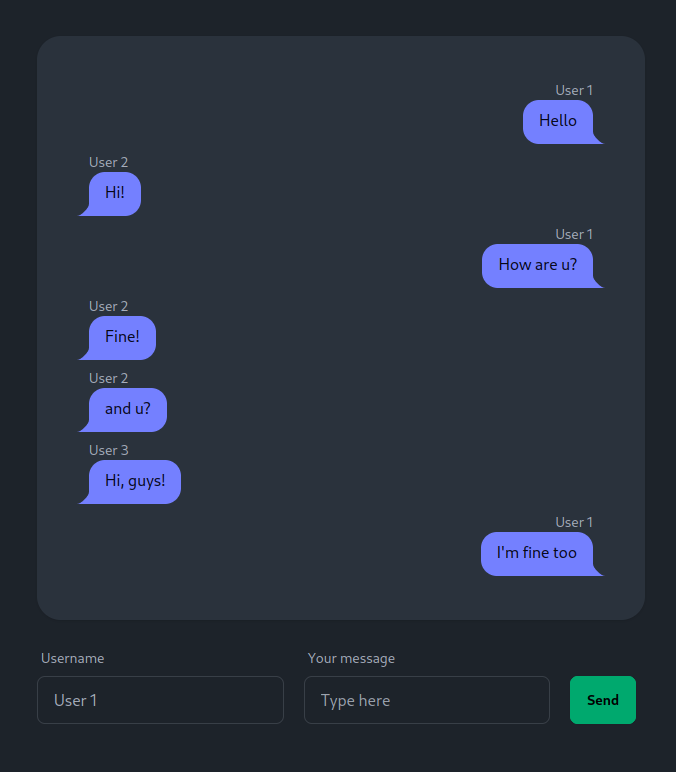

# Global Chat Project

## Descrição

Este projeto é um chat global construído com Node.js e Socket.IO para o backend, e Nginx para o
frontend. O backend lida com as conexões dos usuários e as mensagens enviadas, enquanto o frontend
serve a interface do usuário.

## Screenshot

## Como construir e executar o projeto

### Pré-requisitos

- Docker

### Construção

Para construir as imagens Docker para o frontend e o backend, execute os seguintes comandos:

    # Dentro da pasta /global-chat-backend:
    docker build --tag global-chat-backend .

    # Dentro da pasta /global-chat-frontend:
    docker build --tag global-chat-frontend .

### Execução

Para executar os contêineres Docker para o frontend e o backend, execute os seguintes comandos:

    docker run -d -p 3001:3001 --name GlobalChatBackend global-chat-backend
    docker run -d -p 3000:3000 --name GlobalChatFrontend global-chat-frontend

Ou você pode usar o Docker Compose para construir e executar os serviços:

    docker-compose up --build

### Portas

O serviço backend está escutando na porta 3001 e o serviço frontend está escutando na porta 3000.

### Arquitetura

#### Backend

O backend é construído com Node.js e Socket.IO. Quando um usuário se conecta, ele emite um evento
“private” para o usuário com uma mensagem de boas-vindas. Quando recebe uma mensagem de um usuário,
ele emite um evento “global” com a mensagem para todos os usuários conectados.

#### Frontend

O frontend é um servidor web Nginx que serve os arquivos estáticos gerados pelo processo de
construção do Node.js.
Dockerfiles